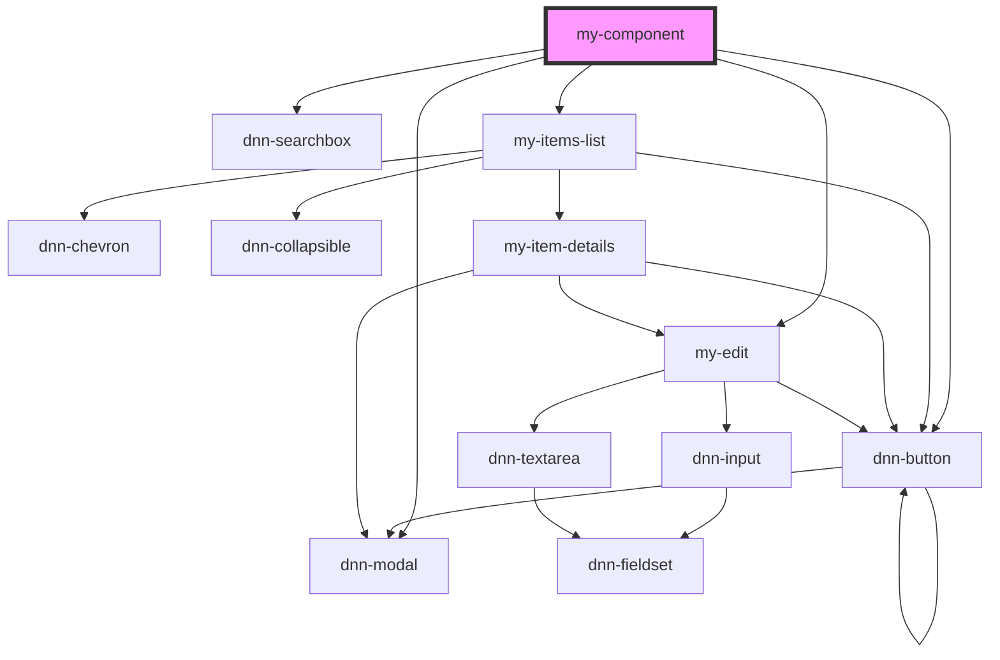

### Depends on

- dnn-searchbox
- dnn-button
- [my-items-list](../my-items-list)
- dnn-modal
- [my-edit](../my-edit)

### Graph

```mermaid
graph TD;
  my-component --> dnn-searchbox
  my-component --> dnn-button
  my-component --> my-items-list
  my-component --> dnn-modal
  my-component --> my-edit
  dnn-button --> dnn-modal
  dnn-button --> dnn-button
  my-items-list --> dnn-chevron
  my-items-list --> dnn-collapsible
  my-items-list --> my-item-details
  my-items-list --> dnn-button
  my-item-details --> dnn-button
  my-item-details --> dnn-modal
  my-item-details --> my-edit
  my-edit --> dnn-input
  my-edit --> dnn-textarea
  my-edit --> dnn-button
  dnn-input --> dnn-fieldset
  dnn-textarea --> dnn-fieldset
  style my-component fill:#f9f,stroke:#333,stroke-width:4px
```