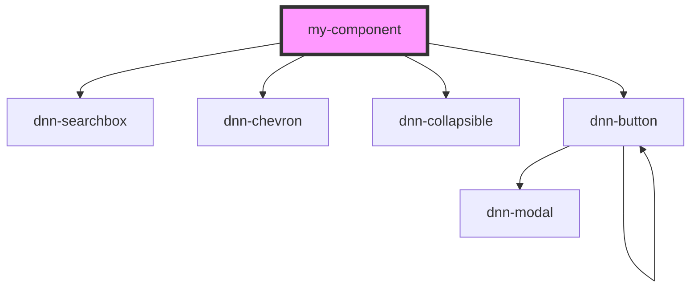

# my-component

<!-- Auto Generated Below -->

## Properties

| Property   | Attribute   | Description       | Type     | Default     |
| ---------- | ----------- | ----------------- | -------- | ----------- |
| `moduleId` | `module-id` | The Dnn module id | `number` | `undefined` |

## Dependencies

### Depends on

- dnn-searchbox
- dnn-chevron
- dnn-collapsible
- dnn-button

### Graph

----------------------------------------------

*Built with [StencilJS](https://stenciljs.com/)*
