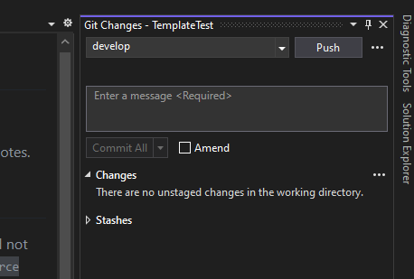
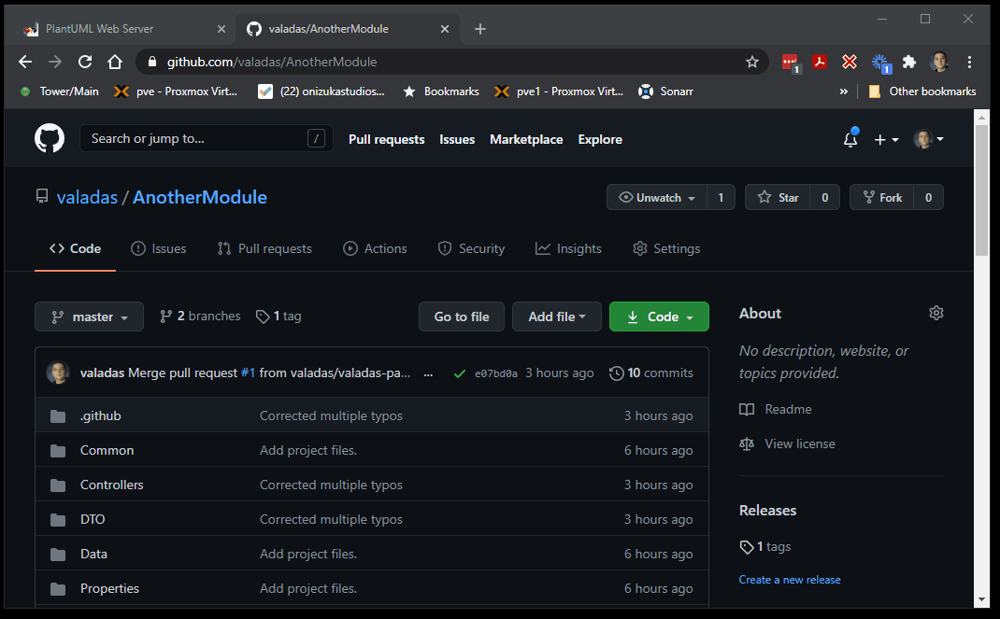
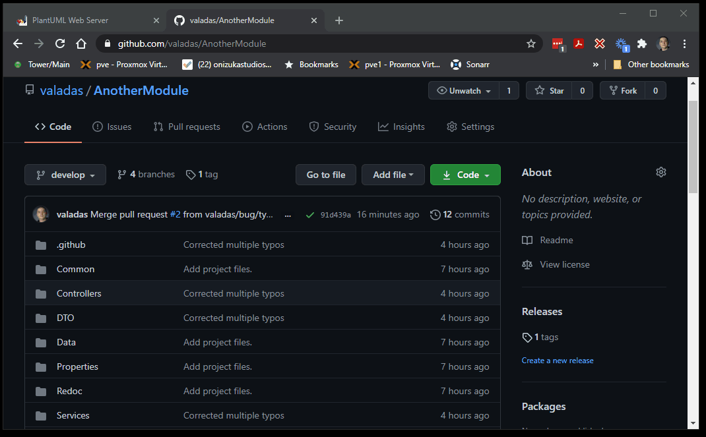

# Git support

To gain the full benefits of this module template it is recommended to set it up as a git repository and to push it to [Github](https://github.com).

> [!NOTE]
> Git and Github are 2 different things. Git is a version control system that works locally and supports having remotes. Github is one of these possible remotes.
## Create a git repository

## Push and create new repository

> [!TIP]
> You can do the next steps using any git client (even the command line), however in this tutorial we'll be using [Github Extensions for VisualStudio](https://visualstudio.github.com/). If you did not select this option when you installed VisualStudio you can download this extension at the link above.
Create you repository by heading to View > Git Changes, the Git Changes side bar menu will appear and you can press on `Push` to have your repository created. 

> [!NOTE]
> You may be asked to login if it's the first time you are using Github integration in Visual Studio. If you are asked to login, it is recommended to create a [Personal Access Token](https://docs.github.com/en/github/authenticating-to-github/creating-a-personal-access-token) instead of using your login/password. Also the Github automations support both private and public repositories.

## First CI Build
In a few minutes you should see that github actinos has run your first build automatically.
This first build will fail because the repository is new and actions don't yet have permissions to write to the repository.
In your repository settings, go to 'Actions' then 'Workflows' and enable "Read/Write" access.

## Automated releases

When you feel you are ready for a beta release, you can create a release branch.
The branch name should include the version number you want, such as `release/0.1.0`.
A few minutes later if you navigate to your repository on Github, you will notice there is a draft release for v0.1.0.
It has auto-generated release notes wrote from the title of all the PRs that went into a milestone of the save version.
It also has the fully packaged module ready for install from testers.
Each additional push or merge into that release branch will produce a new beta release for you automatically.
When you are ready for production, you can simply merge that release branch into `main` or `master` and it will produce a final release for you (non-beta).
If you had any last minute fixes on the release branch that don't exist in `develop` don't forget to merge that branch into `develop` too.

## Automatic Versioning

The template uses [GitVersion](https://github.com/GitTools/GitVersion) and the [GitFlow](https://gitversion.net/docs/git-branching-strategies/gitflow) branching strategy in order to manage versions and releases.

This means:
- The **main** or **master** branch contains the code from the latest published production release. Only merge commits comming from a `release` or `hotfix` branch should be merged to it. Each push to this branch will produce a draft release.
- The **develop** branch contains the latest development code (alpha). Merging or pushing to this branch does not produce any release but you can get the (alpha) build from the branch build status badge. Also any pull request to it builds the project and you also have the PR build artifact available in the action status.
- **release** branches are used to prepare the next release, when a `release/1.0.0` branch is created, a few minutes after, you will have an unpublished release called `v1.0.0-beta-1`. For each further merge or push to the `release/1.0.0` branch, you will get the same version but a new beta sequential member like `v1.0.0-beta-2`. When the release is ready for production, you can merge the `release/1.0.0` into the `main` or `master` branch (usually through a pull request) and it will produce a draft release called v1.0.0 (no longer beta).

> [!TIP]
> By default when you initially pushed the first commit to github earlier, it created only the `main` or `master` branch. You should on github create a `develop` branch from it and then pull that branch before any further development.
## Automatic Release Notes

Release notes for each of those versions are automatically generated from Pull Request (PR) titles for which the milestone matches the released version. The notes are also grouped by label.

## Mergeable

[Mergeable](https://mergeable.readthedocs.io/en/latest/index.html) is a Github extension that enforces some rules over pull requests and/or issues. It is pre-configured in this template to enforce that every pull request has a title, description, label and milestone.

## Dependabot

[Dependabot](https://dependabot.com/) is also pre-setup, it will look at the project dependencies and create automated pull requests when it detects a new version of those dependencies.

> [!TIP]
> Although Dependabot is very useful in warning you about new versions of dependencies and automatically running a built, you should inspect each of those PRs to make sure you do want to accept them. For instance, this template uses Entity Framework and this dll is distributed with the module package. However it's version needs to be declared in the dnn manifest and dependabot is not aware of this. Also, Dnn has some dependencies like Newtonsoft.Json and if you used a different version than Dnn, you may run into some issues which will be hard to catch by unit tests.
## Trying it out

1. Let's make sure we have a develop branch on github and we pull it locally. To do this, we will create the develop branch on github and set it as our default branch. At the same time while we are there, we can setup some branch protection rules to prevent merging PRs that don't build or fail tests, etc. Then we will locally fetch and then pull that branch.

2. Now let's create a new local branch to make a small change that we will then submit as a pull request for. We will push that branch and create a pull request for it on github. Creating a pull request will fire up a build and fire up a set of tests too to validate the change does not break anything. When the build suceeds, we will merge that pull request.

3. Now we will create a 1.0.0-beta release simply by creating a release/1.0.0 branch (it will take a few minutes to create the release). Note that this time because we had a PR with a milestone, we get automatic release notes generated for us.

4. Now let's assume this beta got properly tested and we want to produce the final the final 1.0.0 release, we simply need to merge the `release/1.0.0` branch into our `main` or `master` branch, we will do so using a pull request and we'll do a `merge commit`.

## Documentation

This template has both support for writing your own documentation and also automating documentation from code comments automatically to keep documentation in always in sync with the code.

Github allows having a free documentation website as part of every repository. You may not have realized it yet but it's already done as part of our initial commit.

We simply have to return to github repository settings and set the source for that site. The code can be a folder on any branch or a special branch. Here we will select the docs folder on the branch of our choice.

> [!TIP]
> Selecting the `main` or `master` branch will mean that your published documentation will always be in sync with the latest published official release (non-beta). If you want your documentation to be in sync with the latest changes, you can select the `develop` branch or if you have long standing betas and you want the documentation to reflect it, you can select a `release/x.x.x` branch.
> [!WARNING]
> Do not select a theme in the settings, this is for Jekyll sites which we are not using. Also, it may take Github a few minutes to publish your site.

What you are seeing in Visual Studio now is only some snippets to get you started until the full documentation is published, now that this is done, you can view the full documentation at [https://{owner}.github.io/{repository}](https://{owner}.github.io/{repository}/articles/git.html#documentation)
