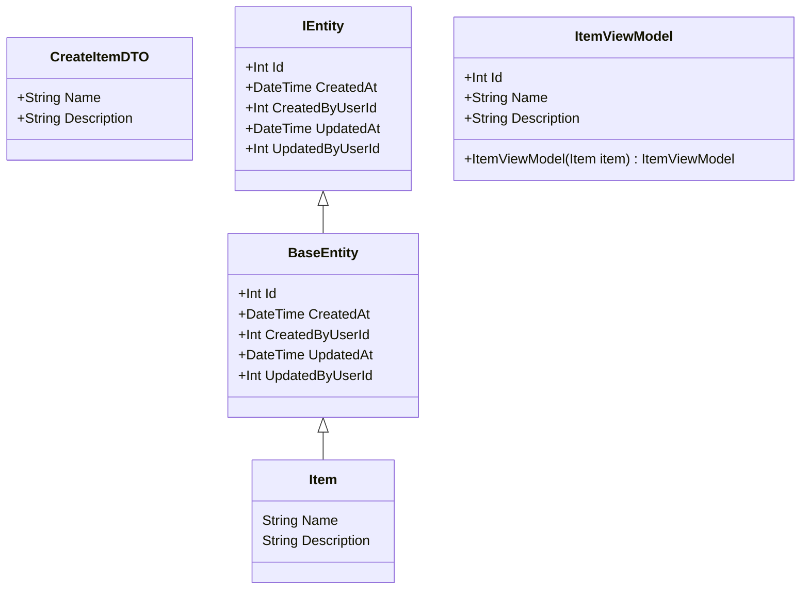
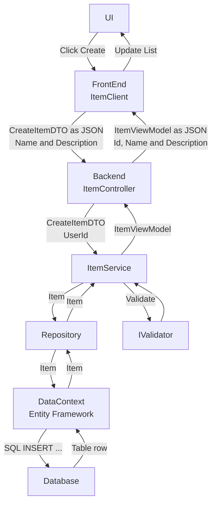
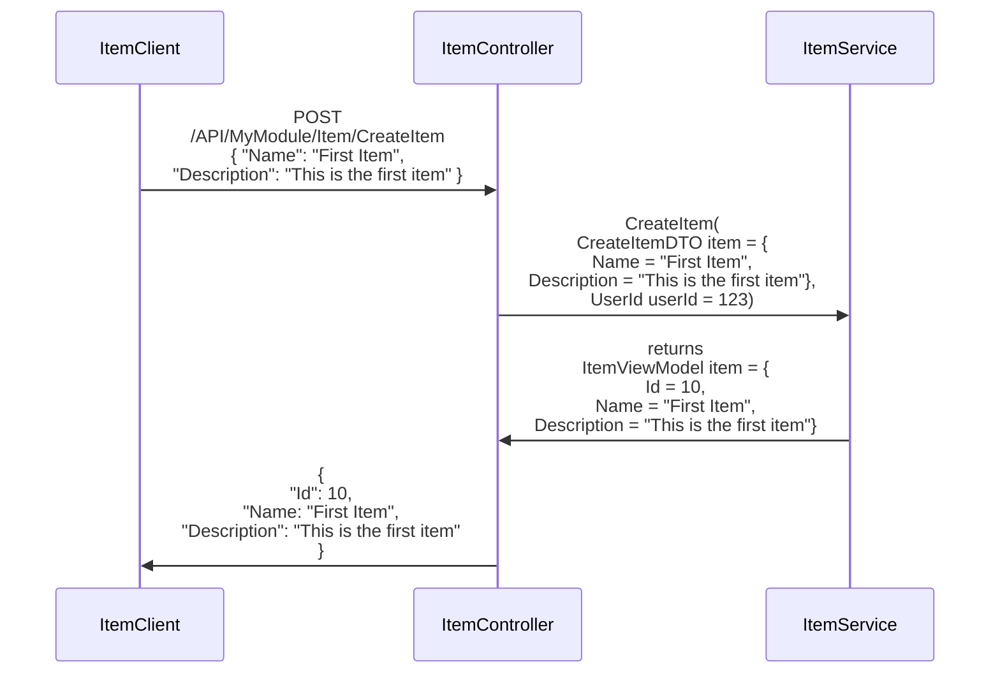
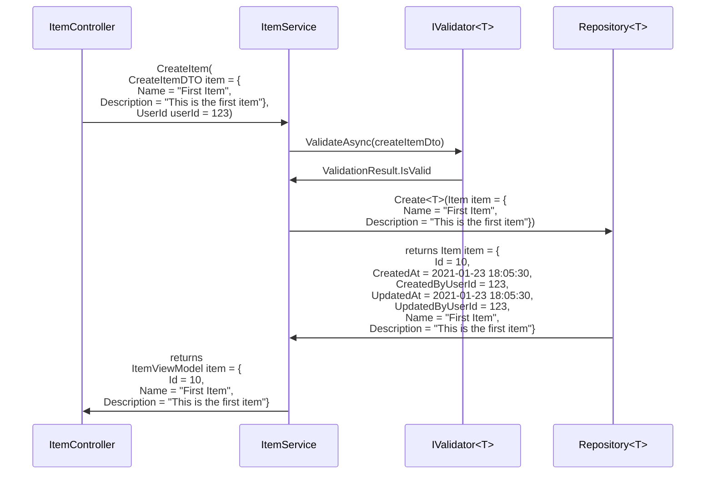
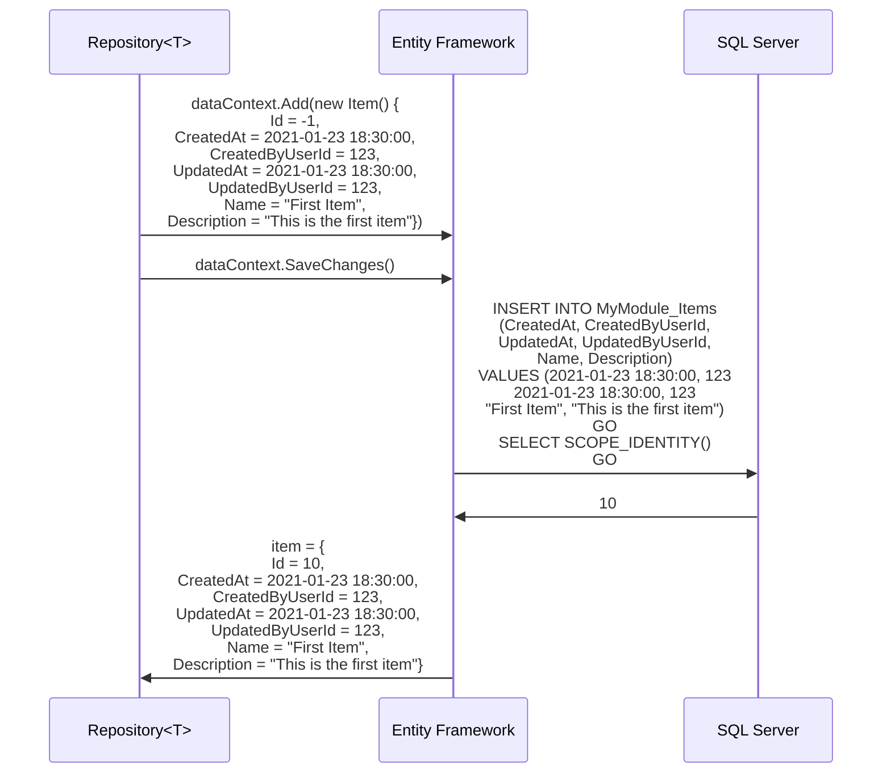
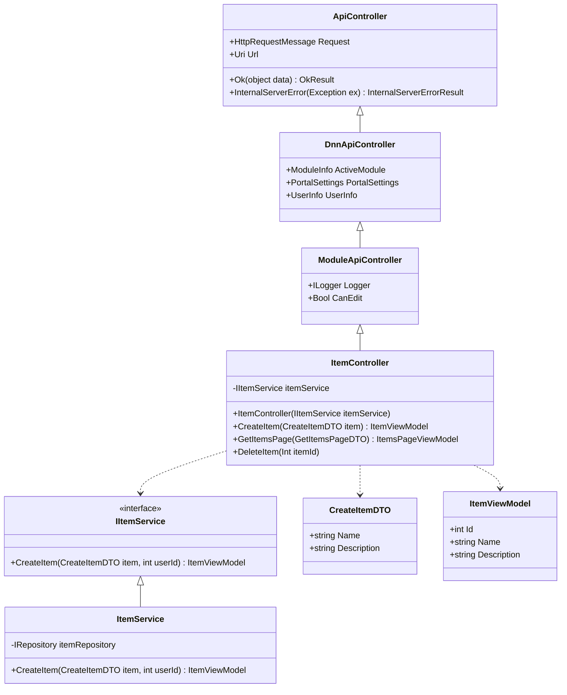
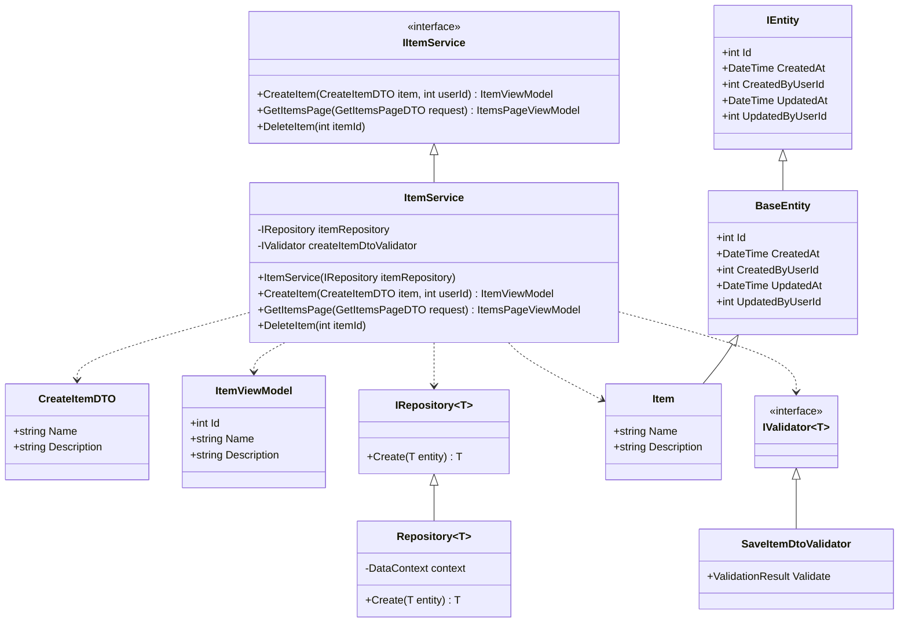
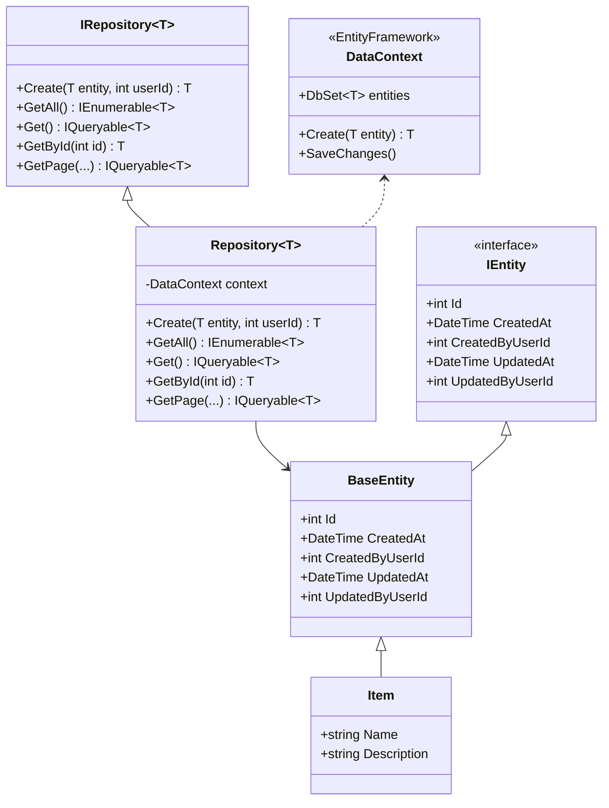

# Project Architecture

## SPA - Web API

This type of Dnn module is commonly knows as a SPA (Single Page Application) module. This common naming does not really reflect correctly the module type. In fact it uses the Dnn `HtmlModule` pipeline. This means the server is not responsible at all for rendering the frontend, it simply serves static html/css/js files to the frontend.

> [!NOTE]
> One small exception to this statement is that Dnn will replace some known tokens in your html view to inject Dnn specific things like the ModuleId for instance.

In order to interact with the server (backend), the frontend will use a REST API to call a backend controller. It can GET some information or POST to perform some action. For security and performance reasons, we may want to have more or less information passed either when we GET or when we POST data.

The graph below explains the various objects used to hold this data.
An entity represents one database table row. 
- **IEntity** is an interface that describes properties that any entity will have. It exists so we can later have Generic implementations of classes.
- **BaseEntity** is a base class. Since interfaces cannot have code, the BaseEntity is used to include code that should run for every entity no matter it's type. For instance when we create a new entity, we inject automatically the CreatedAt and UpdatedAt to the current date and time, we also initialize the CreatedByUserId and UpdatedByUserId to -1 by default.
- **Item** this is one specific entity, in our simple case here an Item simply has a `Name` and `Description`

### Request
When we request the system to create an item, we do not have to pass a full `Item` as the `BaseEntity` already handles that for use for any type of entity. In some cases like for the CreatedByUserId, for security reasons, we don't want to user to tell use his userId from the frontend, we need Dnn to tell us for sure who is logged in. To handle that scenario, the minimum amount of data to create a new Item is just the `Name` and `Desciption` so we use a **Data Transfer Object (DTO)** specific for that operation called `CreateItemDTO`. It's name matches the operation verb, note here we have no Id, because we are creating a new one. If you implement an update method, you may want to create an `UpdateItemDTO` that will have an `Id` too.

### Response
Similarly, we may not want to send all the information about an entity back to the frontend. Let's suppose we have a public list of Items, we probably don't want to expose the CreatedByUserId for security reasons and the CreatedAt because we may not display it. For this scenario we have a `ItemViewModel` that only has the `Id`, `Name` and `Description` properties.

> [!NOTE]
> Notice we have a constructor here that takes an `Item` to quickly create a new ItemViewModel from an Item



## Process Flow
The next graph explains the process flow of creating an item, from the frontend, we `POST` a `CreateItemDTO` as json with a `Name` and a `Description` only; because we are creating a new item, we don't know which id it will get. The backend has all the logic to save the item and we get back an `ItemViewModel` as the response which now has an `Id` on top of the provided (and maybe sanitized or trimmed, depending on your business logic) `Name` and `Description`.

- **UI** is responsible to render the user interface and connect buttons and other HTML elements to handlers.
- **ItemClient** is a frontend (typescript) class, it is responsible only to manage communications between the `Client` and `Server`, it is not concerned with UI tasks.
- **ItemController** is our backend entry point, it is responsible for handling requests and responses only.
- **ItemService** is our business logic and handles our specific business rules only.
- **Repository** is a generic repository, it is responsible to handle data storage and retrieval only. It works with any IEntity, in this specific case it is a Repository&lt;Item&gt; so it does so for Items, but it is reusable with any other entity.


## Sequence

### Frontend <-> Backend
The below diagram explains the interactions between the frontend and the backend. It shows the different objects being passed during the request and response phases. We will look into each of these classes in more details later.



### Our backend code
The below diagram explains the backend code that is part of the module. We will see each class in more details later, but this sequence diagram explain in a bit more details how the data flows.

As we saw earlier, to create an item, the minimum information needed is only the `Name` and `Description`. The `ItemController` adds the acting user id and asks the `ItemService` to create the item.

The IValidator class is used to ensure the data is valid and to provide user friendly localized messages if it is not.

If the data is valid, then the `Repository` adds the information each entity should have like the creation data and others and will save the data to the database (more on this later). It then knows about the `Id` of the recently created item and can return a fully populated `Item` back to the `ItemService`.

Because we don't need all this information for this view, it converts it into an `ItemViewModel` that only has the Id, Name and Description. The `ItemController` then serializes this `ItemViewModel` as json and returns it to the frontend.



> [!NOTE]
> **What if the data is not valid?**
> We use [OneOf](https://www.nuget.org/packages/OneOf) to return either a Success or an Error as a "discriminated union".
> Basically the consumer of a OneOf with have to handle either a .Switch or .Match method to handle all possible return scenarios.
> Each of these scenarios may be a different object as a success and an error are wildly different things.
> In our case, should the DTO not be valid we have an Error&lt;string&gt; with localized errors (one per line) that are user friendly and we return a BadRequest from our controller.

### External code
This module uses [Entity Framework](https://www.entityframeworktutorial.net/what-is-entityframework.aspx) for the data layer. This means amongst other things that we define all our data entities from code using attributes and do not need SQL Scripts in the Dnn extension package. In combination with the [Repository Pattern](https://docs.microsoft.com/en-us/dotnet/architecture/microservices/microservice-ddd-cqrs-patterns/infrastructure-persistence-layer-design) it allows in most cases to also not need complex stored procedures. It also uses IQueryable to combine many filtering/sorting requests and only actually touch the database when needed with a very optimized single query. EF (Entity Framework) supports many different types of databases, this unlinks the module logic from any type of data infrastructure. Right now, this module uses the Dnn database but it can easily be changed to a separate database or even another database type altogether.

> [!WARNING]
> This template does not currently support a {databaseQualifier} or a custom {databaseOwner}. It is not eady but it is possible to support this scenario, if anyone needs this feature, a pull request would be welcome.

> [!NOTE]
> Note that we first call `dataContext.Add(new Item ...)` and as a second step we call `dataContext.SaveChanges()`. For operations that write, the database is never touched until the `SaveChanges` method is called. This allows creating different entities which may have relationships or queuing up many operations to let EF optimize a database query that will be the best for the situation.



## Classes
Now that we have a basic understanding of the overall principles of this pattern, let's examine each class in details. For simplicity only the important code and methods are kept in samples and diagrams below and we will keep discussing only creating a new item.The other scenarios are similar but simply with different request and response data.

### ItemController

#### Responsability

The itemController is responsible for:
- Handling HTTP requests and responses (success or failures)
- Serve as the entry point for dependency injection (we get an IItemService injected by the `Startup` class that implements the `IDnnStartup` interface)
- Provide Dnn context information about the module, the portal and the user for the current request

As you can see, this class has more than one responsability and inherits from other base classes that are not under our control. One of them, `DnnApiController` was not built with unit testing in mind. For those reasons, as part of our unit tests, we exclude the `Controllers` folder.

We use OneOf here to return a result that can be only one of many things. This avoids having to handle exceptions which are not great for performance and have no ways to force consumer implementations. In this case, we ensure that we always have to implement what to do for a success or a failure.

#### Inheritance

The `ItemController` inherits from `ModuleApiController` which provides properties and methods we want to be available in all our controllers. For instance here, we provide an interface for logging and whether or not the user has module edit rights.

The `ModuleApiController` then inherits from `DnnApiController` which provides us Dnn specific information about the module, the portal and the user.

Finally `DnnApiController` inherits from Microsoft `ApiController` which provides all kinds of properties and methods that belong to an WebService API request.

#### Dependencies

- **IItemService** is an interface, we should in our code alway depend on interfaces and not on implementations, this allows easy refactoring or replacement of implementations and makes software more maintainable and testable. Notice we never do `new ItemService()`, we get the implementention get injected for us (Dependency Invertion Principle). In other words:
  1. We don't care how exactly the service creates and item as long as it does create it with the specified parameters and it returns us the correct type. I like to call this the "I don't care how principle".
  2. We only depend on classes when they have only public properties and no methods. In some situations those could be `struct` but there are some gotchas with structs.



```cs
/// <summary>
/// Provides Web API access for items.
/// </summary>
public class ItemController : ModuleApiController
{
    private readonly IItemService itemService;

    /// <summary>
    /// Initializes a new instance of the <see cref="ItemController"/> class.
    /// </summary>
    /// <param name="itemService">The items reposioty.</param>
    public ItemController(IItemService itemService)
    {
        this.itemService = itemService;
    }

    /// <summary>
    /// Creates a new item.
    /// </summary>
    /// <param name="item">The item to create.</param>
    /// <returns>Nothing.</returns>
    [HttpPost]
    [ValidateAntiForgeryToken]
    ...
    public IHttpActionResult CreateItem(CreateItemDTO item)
    {
        var result = await this.itemService.CreateItemAsync(item, this.UserInfo.UserID);
            return result.Match<IHttpActionResult>(
                success => this.Ok(success.Value),
                error => this.BadRequest(string.Join(System.Environment.NewLine, error.Value.Select(e => e.ErrorMessage))));
    }
    ...
}
```

### ItemService

#### Responsability
Service classes are core of our business logic in this pattern. In this case it should enclose all the the requirements that relate to an Item. For instance we could do custom validation or sanitization on values, enforce ralations, etc.

#### Inheritance
The `ItemController` inherits from the `IItemController` interface, again this is to allow using dependency injection where we need it and also help out with unit tests and decoupling classes for easier maintenance.
We also use [FluentValidation](https://www.nuget.org/packages/FluentValidation) here to extract validation into its own class (single responsability principle).

#### Dependencies
Again we only depend on interfaces and data-objects. For instance here we never create an instance of the `Repository`, we get in injected in the constructor from whowever calls this service.



```cs
/// <summary>
/// Provides services to manage items.
/// </summary>
public class ItemService : IItemService
{
    private IRepository<Item> itemRepository;

    /// <summary>
    /// Initializes a new instance of the <see cref="ItemService"/> class.
    /// </summary>
    /// <param name="itemRepository">The items repository.</param>
    public ItemService(IRepository<Item> itemRepository)
    {
        this.itemRepository = itemRepository;
    }

    /// <inheritdoc/>
    /// <exception cref="ArgumentNullException"> is thrown if the item or one of its required properties are missing.</exception>
    public ItemViewModel CreateItem(CreateItemDTO item, int userId)
    {
        var validationResult = await this.createItemDtoValidator.ValidateAsync(item);

        if (!validationResult.IsValid)
        {
            return new Error<List<ValidationFailure>>(validationResult.Errors);
        }

        var newItem = new Item() { Name = item.Name, Description = item.Description };
        await this.itemRepository.CreateAsync(newItem, userId);

        var vm = new ItemViewModel(newItem);
        return new Success<ItemViewModel>(vm);
    }

    ...
}
```

### Repository&lt;T&gt;

#### Responsability
This generic repository provides common data oriented methods that can apply to any entity. You can also create specific repositories instead if you need more methods that are specific to a particular entity. It only responsability is to provide data access in a generic fashion. Of cource we could use Entity Framework anywhere but keeping data-access isolate in a single layer decouples the module from any specific data-access technology and will make both testing and maintainability much easier.

> [!TIP]
> Note that the Create Method initializes the audit control fields (CreatedAt, CreatedBy, etc.). This can only work on properties that exists on any entity (defined in `BaseEntity` or in it's interface `IEntity`). If you have any other methods that can apply to any entity, this is the place to implement it. (note how we don't have an `Update(T entity)` method on purpose for teaching purposes).

#### Inheritance
The `Repository<T>` only inherits from the `IRepository<T>` interface, this allows it to be injected where we need it using Dependency Injection and decouples the implementation from the rest of the code.

#### Dependencies
The `Repository<T>` depends only on EntityFramework `DataContext` (DbContext). Unless you start using EF elsewhere this is the only class that depends on it.

#### Generics
This class is generic, which means it can work on any entity which inherits the `BaseEntity` class. So all it's methods work on any entity you would decide to create as long as your entity inherits from `BaseEntity`.



```cs
/// <summary>
/// Provides common generic data access methods for entities.
/// </summary>
/// <typeparam name="T">The type of the entities.</typeparam>
public class Repository<T> : IRepository<T>
    where T : BaseEntity
{
    private readonly ModuleDbContext context;
    private DbSet<T> entities;

    /// <summary>
    /// Initializes a new instance of the <see cref="Repository{TEntity}"/> class.
    /// </summary>
    /// <param name="context">The module database context.</param>
    public Repository(ModuleDbContext context)
    {
        this.context = context;
        this.entities = context.Set<T>();
    }

    ...

    /// <inheritdoc/>
    public void Create(T entity, int userId = -1)
    {
        if (entity == null)
        {
            throw new ArgumentNullException("entity");
        }

        entity.CreatedByUserId = userId;
        entity.UpdatedByUserId = userId;
        this.entities.Add(entity);
        this.context.SaveChanges();
    }
}
```