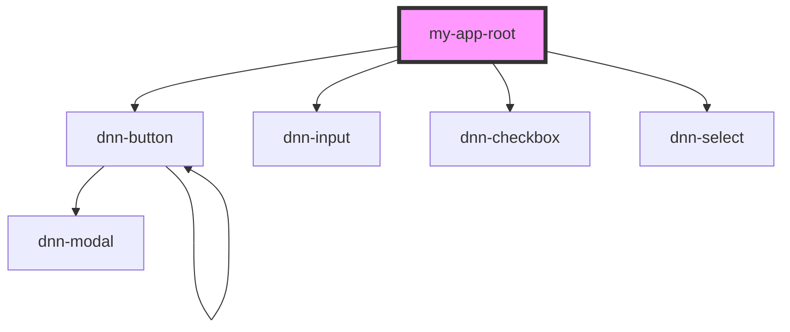

# my-app-root

<!-- Auto Generated Below -->

## Properties

| Property  | Attribute | Description                | Type                                                                                                                                                                                                                                                                                                                                                                                                                                                                                                                                                                                                                                                                                                                                                                                                                                                                                                                                                                                                                                                                                                                                                                                                                                                                                                                                                                                                                                                                                                                                                                                                                                                                                                                                                                                                                                                                                                                                                                                                                                                                                                                                                                                                                                                                                                                                                                                                                                                                                                                                                                                                                                                                                                                                                                                | Default     |
| --------- | --------- | -------------------------- | ----------------------------------------------------------------------------------------------------------------------------------------------------------------------------------------------------------------------------------------------------------------------------------------------------------------------------------------------------------------------------------------------------------------------------------------------------------------------------------------------------------------------------------------------------------------------------------------------------------------------------------------------------------------------------------------------------------------------------------------------------------------------------------------------------------------------------------------------------------------------------------------------------------------------------------------------------------------------------------------------------------------------------------------------------------------------------------------------------------------------------------------------------------------------------------------------------------------------------------------------------------------------------------------------------------------------------------------------------------------------------------------------------------------------------------------------------------------------------------------------------------------------------------------------------------------------------------------------------------------------------------------------------------------------------------------------------------------------------------------------------------------------------------------------------------------------------------------------------------------------------------------------------------------------------------------------------------------------------------------------------------------------------------------------------------------------------------------------------------------------------------------------------------------------------------------------------------------------------------------------------------------------------------------------------------------------------------------------------------------------------------------------------------------------------------------------------------------------------------------------------------------------------------------------------------------------------------------------------------------------------------------------------------------------------------------------------------------------------------------------------------------------------------- | ----------- |
| `util`    | --        | The persona bar utilites.  | `{ sf: IPersonaBarServicesFramwork; onTouch: boolean; dayjs: () => Dayjs; persistant: IDnnPersonaBarPersistant; inAnimatin: boolean; setConfirmationDialogPosition: () => void; openSocialTasks: () => void; closeSocialTasks: () => void; expandPersonaBarPage: () => void; contractPersonaBarPage: () => void; closePersonaBar: (callback?: any, keepSelection?: boolean) => void; loadPanel: (identifier: string, params: any) => void; panelLoaded: (params: any, loaded: boolean) => void; initCustomModules: (callback: () => void) => void; loadCustomModules: () => void; leaveCustomModules: () => void; findMenuSettings: (identifier: string, menuItems?: IDnnPersonaBarMenuItem[]) => any; updateMenuSettings: (identifier: string, settings: any, menuItems?: IDnnPersonaBarMenuItem[]) => void; loadBundleScript: (paths: string \| string[]) => void; panelViewData: (panelId: string, viewData: any) => any; savePanelTabView: (panelId: string) => void; updatePanelTabView: (panelId: string) => void; loaded: (template: string) => boolean; loadTemplate: (folder: string, template: string, wrapper: JQuery<HTMLElement>, cb: () => void) => void; loadResx: (cb: () => void) => void; getResx: (moduleName: string, key: string) => string; getModuleNameByParams: (params: any) => string; getIdentifierByParams: (params: any) => string; getFolderNameByParams: (params: any) => string; asyncParallel: (deferreds: (() => any)[], callback: () => any) => void; asyncWaterfall: (deferreds: (() => any)[], callback: () => any) => void; confirm: (text: string, confirmBtn: string, cancelBtn: string, confirmHandler: () => void, cancelHandler: () => void) => void; notify: (text: string, options?: number \| IDnnPersonaBarNotificationOptions) => void; notifyError: (text: string, options?: IDnnPersonaBarNotificationOptions) => void; localizeErrMessages: (validator: IDnnPersonaBarValidator) => void; trimContentToFit: (content: string, width: number) => string; getObjectCopy: (object: object) => object; throttleExecution: (callback: () => any) => void; ONE_THOUSAND: 1000; ONE_MILLION: 1000000; formatAbbreviateBigNumbers: (number: number) => string; getCulture: () => string; getSKU: () => string; getNumbersSeparatorByLocale: () => string; formatCommaSeparate: (number: number) => string; secondsFormatter: (seconds: number) => string; getApplicationRootPath: () => string; getPanelIdFromPath: (path: string) => string; parseQueryParameter: (item: IDnnPersonaBarMenuItem) => void; buildMenuViewModel: (menuStructure: IDnnPersonaBarMenuStructure) => { menu: { menuItems: IDnnPersonaBarMenuItem[]; }; }; getPathByModuleName: (menuStructure: IDnnPersonaBarMenuStructure, moduleName: string) => string; }` | `undefined` |
| `wrapper` | --        | The wrapping html element. | `HTMLElement`                                                                                                                                                                                                                                                                                                                                                                                                                                                                                                                                                                                                                                                                                                                                                                                                                                                                                                                                                                                                                                                                                                                                                                                                                                                                                                                                                                                                                                                                                                                                                                                                                                                                                                                                                                                                                                                                                                                                                                                                                                                                                                                                                                                                                                                                                                                                                                                                                                                                                                                                                                                                                                                                                                                                                                       | `undefined` |

## Dependencies

### Depends on

- dnn-button
- dnn-input
- dnn-checkbox
- dnn-select

### Graph

----------------------------------------------

*Built with [StencilJS](https://stenciljs.com/)*
